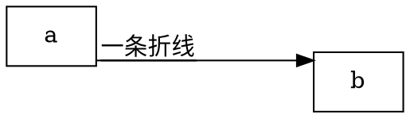

# 2022年11月12日
## 11点57分，关于graphviz的一些心得

- graphviz的文档比较晦涩。关于如何调整绘图的示例太少了。
- 得跟着bnf定义一点点查然后一个个试，这个也许可以做个视频？

这几个小时的时间主要解决的是graphviz如下问题：
1. 如何绘制一个基本的graphviz图形
1. 如何控制节点的外形
1. 如何控制连线的属性
    1. 如何搞成正交折线
    1. 如何给连线做标注
    1. 如何让标注和连线的对应关系更加醒目

正交折线: 

- edge可以设置id，但不可以设置class，至少在svg输出中，id可见，class不可见
- edge的标注可以有多行，所以可以用简单粗暴的实现